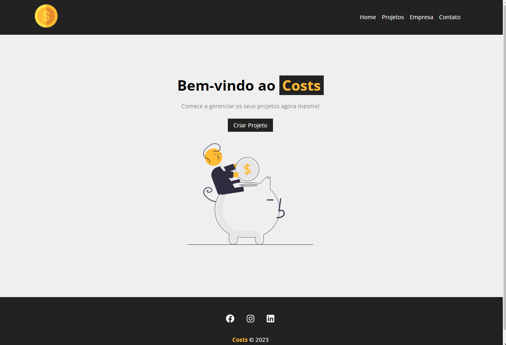

# Costs

Costs is a React-based web application designed to help you efficiently manage your personal projects.

  <a href="#about-the-project">About the Project</a>&nbsp;&nbsp;&nbsp;|&nbsp;&nbsp;&nbsp;
  <a href="#features">Features</a>&nbsp;&nbsp;&nbsp;|&nbsp;&nbsp;&nbsp;
  <a href="#getting-started">Getting Started</a>&nbsp;&nbsp;&nbsp;|&nbsp;&nbsp;&nbsp;
  <a href="#prerequisites">Prerequisites</a>&nbsp;&nbsp;&nbsp;|&nbsp;&nbsp;&nbsp;
  <a href="#licença">Licença</a>&nbsp;&nbsp;&nbsp;|&nbsp;&nbsp;&nbsp;
  <a href="#contact">Contact</a>

  

  

## About the Project

Costs was developed to provide a simple and intuitive solution for managing your personal projects. The application allows you to create, view, and organize tasks effectively.

### Features

- Create projects and assign tasks to each project.
- See your services.
- ...

## Licença

Esse projeto está sob a licença MIT.

## Contact

For questions or suggestions, contact via email emerson8096@gmail.com
